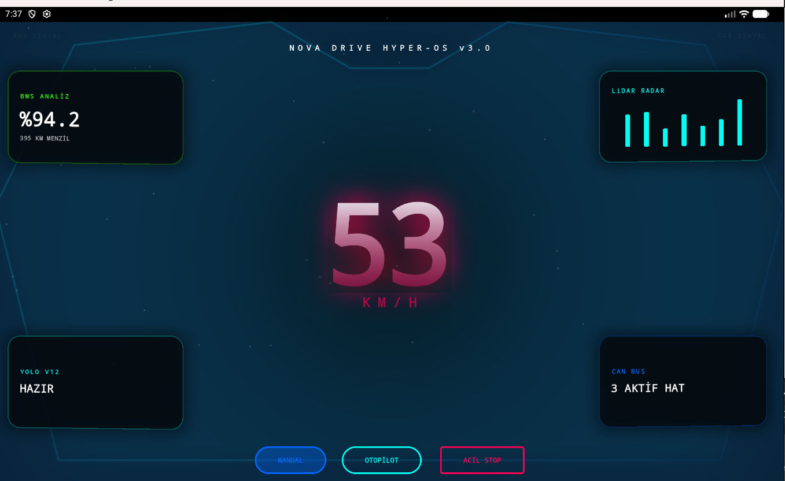
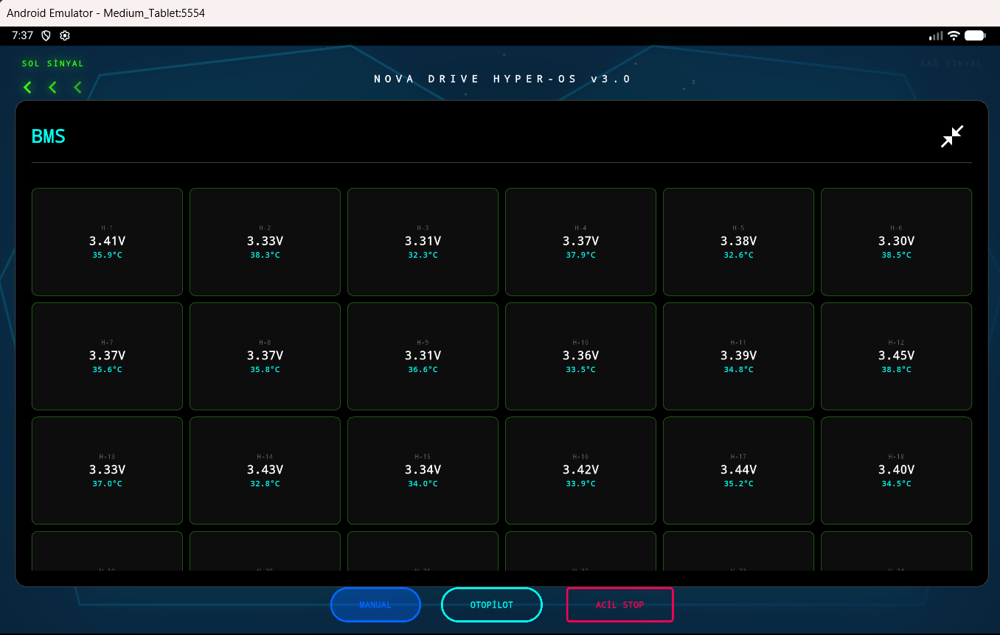
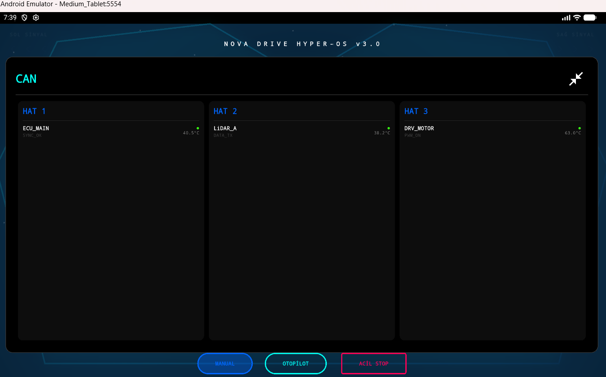
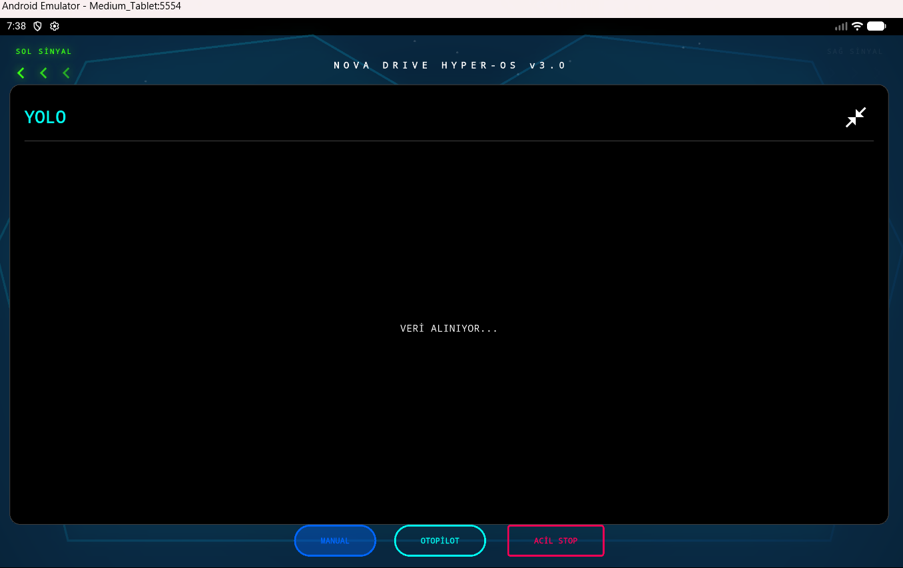
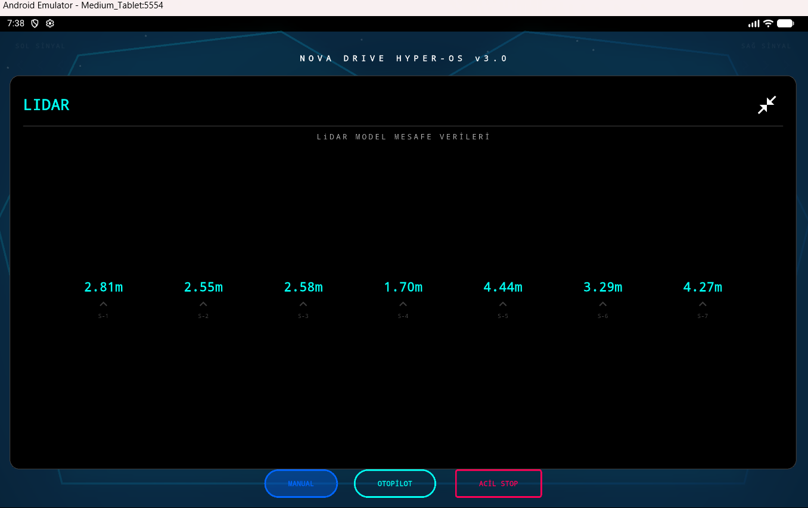

# Nova Drive - Autonomous Vehicle HMI Panel

## About the Project
This project is a Human-Machine Interface (HMI) control panel developed using Flutter for the Nova Drive autonomous vehicle. The system is designed to transform complex data from the vehicle's autonomous driving algorithms and hardware sensors into an understandable and interactive interface for the user.

> **Note:** Mock data is currently used in this project for demonstration purposes. Real hardware, CAN Bus, and sensor connections can be integrated and provided if desired.

## Screenshots







## Key Features
* **Real-Time Telemetry:** Zero-latency digital speedometer and real-time vehicle status dashboard.
* **Sensor Visualization:** Real-time on-screen projection of environmental data obtained from LiDAR hardware and the YOLO (You Only Look Once) object detection algorithm.
* **System Integration:** Communication and data flow management with in-vehicle systems via the CAN Bus communication protocol.
* **Optimized User Experience (UI/UX):** Distraction-free, highly responsive interface architecture specifically designed for in-vehicle touch screens.

## Technologies Used
* **Frontend:** Flutter, Dart
* **Communication & Data:** CAN Bus Interface 
* **Autonomous System Inputs:** LiDAR, YOLO

## Installation and Execution

You can use the following commands to install the required dependencies and start the project:

```bash
flutter pub get
flutter run
